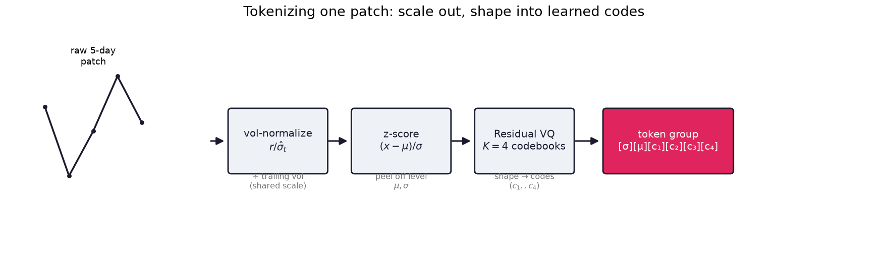
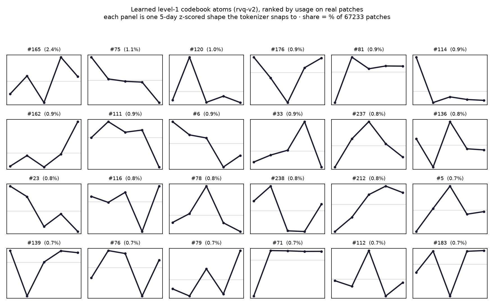
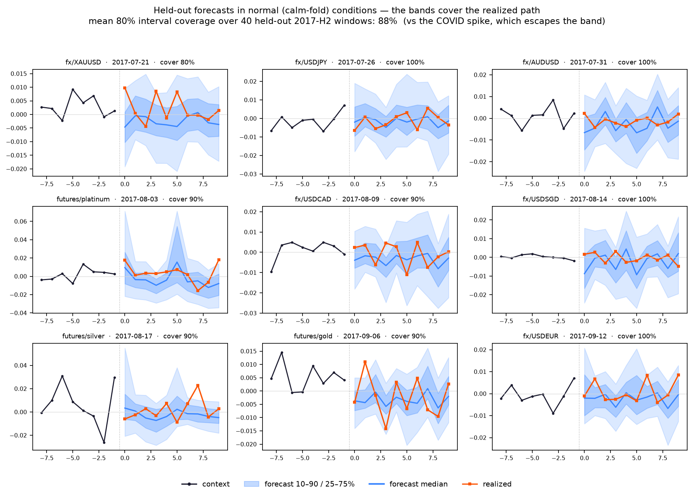

*Revised on June 14, 2026.*

I've spent a lot of time in my career building time series forecasting algorithms. I've used
hierarchical forecasting with trees,
XGBoost, Chronos, PatchTST, and the rest of the usual toolkit. They work, up to a point. But
every time I looked at where machine learning was actually compounding, the answer was the
same. It was language models. The entire research stack, the tooling, the scaling laws, the
reinforcement-learning machinery that turns a pretrained model into something that reasons,
all of it was being poured into one architecture.

So I kept returning to one question. What would it take to forecast markets with
that architecture, not as an analogy, but literally? Not "transformers for time series,"
which already exists, but a model that is a decoder-only language model in every structural
sense, where the only thing that changes is the alphabet. And if the only thing that changes
is the alphabet, then the whole problem reduces to one I had been underestimating: what *is*
the right alphabet for market signal? How do you turn a few hundred raw price series into
discrete tokens that an LLM-style stack can read and write? Get that right and every tool
built for LLMs applies to my problem for free, all the way down to the part I care about most
and that motivates the entire design: post-training a token policy with reinforcement learning
against a verifiable reward.

That tokenizer is the contribution of this post. Part 1 is me reasoning through the alphabet
from the ground up: I start from what a forecaster has to do, show where the usual recipe
stops short, and let each fix introduce exactly one piece of the design, until a patch of
market data serializes into discrete tokens the way a chunk of text serializes into
word-pieces. Around that I'll show two things honestly. The pretraining on top of these tokens
is early and still in progress, so I'll report where it actually stands on data the model
never trained on, neither more nor less. And RLVR, the destination the discrete design is
built for, gets laid out as the path the series is walking toward, with the experiments
reserved for Part 2.

The whole bet in one picture, and it rests entirely on the alphabet. A decoder-only language
model and an autoregressive forecaster are the same machine: a causal transformer predicting
the next symbol from the past. The backbone, the mask, and the softmax head are shared. The
only thing you have to invent is the symbol set, the tokenized market signal that replaces
word-pieces, which is exactly what this post builds.

---

## What a forecaster actually has to do

Strip the problem down. I observe a price series, or a few hundred of them, and I want to say
something useful about the future. Three requirements survive that stripping, and each one
will force a design decision later, so I want them on the table first.

I need a distribution, not a number. A point estimate of tomorrow's return is close to
useless on its own, because the entire game is the shape of the cone of outcomes and where
its mass sits. Whatever the model emits, I have to be able to compute quantiles, intervals,
and calibration from it.

I need to use many series at once. Assets move together. A forecast for one name that
ignores the hundred correlated names trading beside it throws away most of the information in
the tape. The model has to read a cross-section.

I need no look-ahead, ever. The moment a forecast sizes a position, any leakage of future
information becomes unrecoverable and quietly inflates every backtest I run. Causality has to
be enforced by the architecture, not by my good intentions.

Hold those three. The rest of the post earns them one at a time.

---

## Where the standard recipe stops short

The obvious starting point is the recipe patch-based time-series transformers already use,
the PatchTST and Chronos lineage. Chop each series into fixed-length patches, project each
patch through a linear map into the model dimension, run a transformer, attach a
regression or Gaussian head. It works. It is also where my "literally an LLM" constraint
starts to bite, in two places.

The first problem is the input. A linear patch embedding is a fixed, content-blind basis.
Every patch, whether it is a sleepy drift or a once-a-year volatility shock, goes through the
same projection and gets the same share of representational budget. A language model does the
opposite. Its tokenizer spends short codes on common pieces and keeps expressive structure
for rare ones, and crucially the embedding table is learned, so representation follows the
data. I want that for signal shapes. I want a quiet five-day drift and a gap-up to be
genuinely different tokens, not two points in the same linear subspace.

The second problem is the output, and here I want to be careful not to overstate the case. A
regression head gives a point. A Gaussian head gives a parametric interval. A quantile head
gives several. The honest position is that a Gaussian or a quantile head is already samplable
and already trainable by policy gradient — continuous policies do reinforcement learning
perfectly well, and discreteness is not a mathematical prerequisite for any of it. I want to
say that plainly because the opposite is an easy thing to imply.

So the case for going discrete is an engineering one, not a theorem. A finite vocabulary with
an exact softmax gives every action an exact log-probability, freezes the action space into
something stable to optimize against, and lets the entire LLM reinforcement-learning and
serving stack apply unchanged. That is worth a great deal. It is also not free: quantizing a
continuous shape introduces reconstruction error, and on a signal whose daily directional edge
is already tiny, that quantization error is a real cost rather than a rounding detail — the
round-trip NMSE I report later is small in absolute terms but not obviously small relative to
the size of the edge I am hunting. I take the trade deliberately, with the price in view.

Both problems point the same way, and the first one is the one this post is really about.
Replace the linear patch map with a learned, discrete vocabulary of signal shapes, and keep
everything downstream discrete so the output stays a clean token policy. That one decision, the
alphabet, is the heart of the model and the contribution of Part 1, so it gets the longest
section.

---

## The core move: a learned alphabet for market signal

This is the contribution of Part 1, so I'm going to take it slowly and earn each piece. I want
to turn a patch of a series into a token, the way a tokenizer turns a chunk of text
into a word-piece. Doing that on raw returns fails for a reason worth stating, because the
fix is the first real piece of the architecture.

### Normalize first, so one vocabulary can span every instrument

A five-day window of ten-year-yield returns and a five-day window of crypto returns differ in
volatility by one to two orders of magnitude. A single codebook fit on both would waste most
of its capacity encoding scale rather than shape. So I factor scale out before quantizing.

Let $P_t$ be the price and $r_t = \log(P_t / P_{t-1})$ the log return. I divide by a
trailing, lagged volatility estimate $\hat{\sigma}_t$, an exponentially weighted moving
average over returns strictly before $t$, to get a vol-normalized return

$$
x_t \;=\; \frac{r_t}{\hat{\sigma}_t + \epsilon}.
$$

That puts a bond and a coin on the same footing. Then I z-score the patch itself. With patch
mean $\mu$ and patch standard deviation $\sigma$ taken over the normalized values, the
shape is

$$
\hat{x} \;=\; \frac{x - \mu}{\sigma + \epsilon},
$$

a roughly unit-scale curve that means the same thing wherever it came from. The two scalars I
peeled off, $\mu$ and $\sigma$, are not thrown away. I will re-emit them as tokens in a
moment, because anything I normalize away has to come back as a prediction target if I ever
want to forecast it. De-normalization at decode time just inverts the chain,

$$
r \;=\; \big(\hat{x}\,\sigma + \mu\big)\,\hat{\sigma}_t .
$$

One discipline runs through all of this and it is non-negotiable: every statistic uses only
data at or before its own patch. The vol estimate is lagged, the patch stats are local,
nothing is fit on data that postdates what it touches. That is the no-look-ahead requirement
showing up at the very first step, and getting the inverse of this chain exactly right turned
out to matter more than I expected, which I will come back to in the results.

Tokenizing one patch. Scale is divided out first so a single codebook serves every
instrument, the level $\mu,\sigma$ is peeled off, and the residual VQ turns the remaining
shape into code indices.

### Quantize the shape with a learned codebook, not a projection

Now I turn the shape $\hat{x}$ into discrete codes. The naive version snaps it to the nearest
entry in a single codebook, but one nearest-neighbor lookup is a blunt instrument. Real
patches are blends, a trend with noise riding on it, and the closest single template throws
the blend away.

So I use Residual Vector Quantization. Keep a stack of $K$ codebooks, each of size $V$,
with embedding vectors $e_k[\cdot]$. The first codebook captures the coarse shape, I subtract
its reconstruction, and pass the residual to the next codebook, which refines it, and so on
through all $K$ levels:

$$
\hat{x} \;\approx\; \sum_{k=1}^{K} e_k[c_k], \qquad c_k \in \{1, \dots, V\}.
$$

The shape becomes an ordered tuple $(c_1, \dots, c_K)$, coarse to fine. This buys an effective
vocabulary of $V^K$ distinct shapes while storing only $K \cdot V$ embedding rows, and it
represents blends naturally, because each level corrects what the previous one missed. I train
it end to end with a straight-through estimator and a commitment loss, plus the usual VQ
hygiene to stop the codebook collapsing: EMA code updates, dead-code revival, and a
utilization target.

I can watch the refinement happen on a real patch. This one takes a volatile five-day window
and rebuilds it one codebook at a time. The first code lands a coarse approximation, and each
level chips away the residual, so the reconstruction error falls monotonically.

Four levels of $V=256$ codes take one shock patch from NMSE 0.135 to 0.006. Coarse first,
then residual refinements.

Once trained, the codebook is a dictionary of recurring shapes the data taught it, not a
basis I imposed. I can look at the dictionary directly by decoding each code back into the
five-day curve it stands for. These are the most frequently used first-level atoms across
tens of thousands of real patches, and they read like an alphabet of elementary moves: ramps,
reversals, single-day pops, quiet drifts.

The 24 most-used first-level atoms, ranked by selection frequency over 67,233 real patches.
Each panel is one learned shape.

The test that matters is whether real patches survive the round trip, especially the ones a
forecaster cannot afford to blur. They do. Here are three patches a model has to get right, a
clean trend, a choppy reversal, and a volatility shock, each decoded back from its four codes.

Real patches (solid) and their tokenized reconstructions (dashed). The bracketed integers
are the four code indices; titles report reconstruction NMSE, all around 0.006.

### The levels become tokens too

I still have the two scalars I peeled off, the patch drift $\mu$ and the patch volatility
$\sigma$. I could feed them back as raw numbers, but that reintroduces a continuous quantity
into a model I am keeping discrete, and a scalar magnitude multiplying a vector tends to
collapse the representation onto a single ray. So I bin them and emit them as their own
tokens, each with its own embedding row. The volatility token is binned as a vol
innovation, realized patch vol relative to the trailing estimate, which sits near one and is
far more stationary across instruments than absolute vol. The drift token bins $\mu$ on a
symmetric grid around zero.

A patch of one instrument at one time now serializes to a fixed-length token group:

$$
\big[\,\sigma\,\big]\ \big[\,\mu\,\big]\ \big[\,c_1\,\big]\ \big[\,c_2\,\big]\ \cdots\ \big[\,c_K\,\big].
$$

The analogy is exact. A patch is a word, and its token group is the spelling of that word in
an alphabet of scales and shapes. Everything the model reads or writes is now a token from a
finite vocabulary, which is the property I set out to preserve.

---

## Hundreds of series in one sequence

I can tokenize one patch. A forecaster that reads one series at a time still fails the second
requirement, so now I lay every instrument into a single sequence.

Every instrument is just a stream id, and I flatten all of them into one sequence of token
groups sorted by $(\text{timestamp}, \text{stream})$. This is an any-variate layout. A
series that trades rarely, or has a gap, simply contributes no tokens where it has no
observation. No imputation grid, no per-channel padding. A weekly series drops in one group a
week, slotted into the timeline beside the daily names. Because every stream lives in the same
sequence, attention is what correlates them: a token at time $t$ can attend to the tokens of
any stream at earlier timestamps. Cross-asset structure gets learned by the same mechanism
that learns time. I deliberately do not split the streams into independent channels, because
the relationships between assets are the most valuable thing in the data.

That leaves the causal rule, the one genuinely subtle part, and it is where the third
requirement gets enforced. The mask is block-causal by timestamp. Writing $\mathrm{ts}$,
$\mathrm{stream}$, and $\mathrm{slot}$ for a token's timestamp, stream, and position within
its group, query $a$ may attend key $b$ iff

$$
\mathrm{ts}_b < \mathrm{ts}_a
\;\;\lor\;\;
\big(\mathrm{ts}_b = \mathrm{ts}_a \,\land\, \mathrm{stream}_b = \mathrm{stream}_a \,\land\, \mathrm{slot}_b < \mathrm{slot}_a\big)
\;\;\lor\;\;
a = b .
$$

A token attends everything strictly earlier in time on any stream, and earlier slots inside
its own group so that $c_2$ sees $c_1$. Tokens that share a timestamp but belong to different
streams do not attend to each other while they are being predicted. They are contemporaneous,
not causal predecessors. Once realized they become ordinary context for everything at $t+1$
and later. I give up same-bar cross-asset information at prediction time, and I take that
trade on purpose, because a lost contemporaneous signal is a known limitation while look-ahead
bias is an unrecoverable error.

The actual mask, computed on a tiny two-stream by three-timestamp example. Green is allowed.
The highlighted cell is the one rule that costs us something: at the same timestamp, stream A
may not look at stream B.

Positions and identity follow LLM practice with one adjustment for the two-dimensional layout.
Rotary embeddings run over the time axis, and a learned instrument embedding acts as a
segment marker so the model knows which stream a token belongs to. Calendar features, the
signal family, and the volatility regime enter as additive conditioning embeddings, exactly
how you would condition an LLM on side information. One generalization comes almost for free:
non-price signals, event probabilities or physical-flow volumes, ride in as extra streams with
their own per-family tokenizers, masked out of the loss so they inform forecasts without ever
becoming forecast targets.

---

## Predicting the next group, and reading a forecast off samples

With the inputs settled the output side is almost entirely standard. The model predicts the
next token group autoregressively with a single softmax head over the unified vocabulary, tied
to the input embeddings, just like an LLM. The only addition is a grammar: the slot a token
occupies inside its group decides which tokens are legal, and the sampler masks the rest. The
group factorizes into a short autoregressive chain of its own, nested inside the chain over
time:

$$
p(\text{group}_t \mid \text{context}) \;=\; p(\sigma)\;p(\mu \mid \sigma)\;\prod_{k=1}^{K} p\big(c_k \mid \sigma, \mu, c_{\lt k}\big).
$$

Training is the causal language-modeling loss you would expect, cross-entropy on the predicted
token slots. One honest note from pretraining, because it looks like a bug and is not: the
drift token's head stays close to uninformative. Daily drift is tiny next to daily volatility,
which is just market efficiency asserting itself, so the model learns that predicting drift
sharply is mostly a way to be wrong. I leave that head honest for now. Sharpening it is a job
for later, and it is exactly the job I want RL to do.

I do not emit an interval. I sample. From a shared context I draw $G$ rollouts at
temperature $\tau$, decode each group back to returns through the inverse of the normalization
chain, and read quantiles, coverage, and any scoring rule off the empirical ensemble of
trajectories. This is the Chronos approach, and it is the only output scheme that is at once
fully probabilistic, directly calibratable, and a legitimate token policy with exact per-token
log-probabilities. It is also cheap, for the same reason LLM serving is cheap: one prefill of
the shared context, then fork the KV cache $G$ ways and decode in parallel.

---

## Where pretraining stands (in progress)

That is the architecture, and the tokenizer at the center of it is what Part 1 is claiming. The
pretraining that sits on top of these tokens is early and still running, so I want to be careful
to report it as what it is: preliminary checkpoints, not a finished model, and certainly not a
trading result. What I can do honestly is check the two things that have to be true before any
of the rest matters, on held-out data, because a clean design is worth nothing until it survives
contact with windows the model never saw. Everything below is on the project's fixed
walk-forward eval folds, with a thirty-day embargo between the training cutoff and the
evaluation window.

Start with tokenization, on the hardest data I have. This is palladium futures through
February to April 2020, deep in the held-out COVID window and well after the model's
January-2020 cutoff. The market never seen, a violent crash included.

A held-out window strung together as tokens. Panel (a) is the raw series, (b) overlays the
reconstruction decoded from the tokens, and (c) is the token sequence itself. The production
group carries one extra slot, a tail-event "surprise" token $s$, which fires on the −23% crash
day where the move clears four sigma, recording the extreme that the clipped shape codes
cannot. The vol tokens track the elevated volatility throughout.

The reconstruction tracks the crash, and the tail-event token fires exactly where it should.
The tokenizer generalizes. The harder question is forecasting, so let me show you the case it
gets wrong first, on purpose. Same held-out COVID window, now forecasting the last two patches.

Forecasting the held-out window. The model gets the regime right, its sampled vol tokens sit
in the high-volatility bins, but it cannot call the specific +19% one-day spike, which blows
clean through the cone before the path settles back inside it. The median drift stays near
zero and the band widens rather than chasing the move. That is the honest limit: at the
extreme, the size of a single move is not forecastable.

I picked the crash because it is the hard case, but the everyday case is what decides whether
the forecaster is useful, and there I have many more examples. Here are held-out forecasts for
nine different instruments across the calm 2017 fold, the quietest stretch in the data.

Nine held-out forecasts, one instrument per panel, from the calm eval fold. Black is the
context tail, blue the quantile bands and median, orange what actually happened. Across forty
held-out windows, the model's 80% interval covers the realized return about 88% of the time.

So where does that leave us. The tokenizer round-trips cleanly on held-out data, including
crashes. The forecaster looks calibrated in normal conditions: across forty held-out windows,
its nominal 80% interval covers the realized return about 88% of the time, erring mildly
conservative rather than overconfident. I want to be honest about how much weight that single
number can bear, though, because it is less than it looks. Forty walk-forward windows overlap
heavily, so they are nowhere near forty independent observations — the effective sample size is
smaller than the count suggests, and an 88% point estimate from correlated windows carries a
wide confidence band around it. One nominal level checked this way is a sanity check, not a
calibration certificate. The defensible version of the claim is a reliability curve that sweeps
several nominal levels with bootstrapped intervals, reported next to a proper score such as
CRPS; that fuller picture is what the next checkpoint is being held to. From here, the most I
will say is that the model reads as mildly over-covering rather than overconfident. And it is
honest about its limit: it flags a high-volatility regime through the vol token, but it will not
pretend to predict the direction and size of a one-day shock, because nothing should.

I want to be precise about what this is and is not, especially since pretraining is still
running. This is a calibration result from an early checkpoint, not yet a skill-beats-baseline
result, and I am not claiming it as one. Skill is a comparative claim, and it has a bar: the
cheap competitor is a last-value drift with EWMA volatility bands, and the distributional
competitors are the zero-shot foundation models I started from — Chronos and TimesFM — with a
classical ARIMA underneath them. Turning "calibrated" into "calibrated and competitive" means
beating those on a matched, like-for-like episode set, and getting that comparison genuinely
apples-to-apples — same universe restriction, same windows — is finicky enough that I would
rather finish it than quote ratios I cannot yet stand behind. So I am stating the bar here and
deferring the table, on purpose. The forecast median sits near zero, like a last-value baseline,
because daily drift is barely forecastable from cross-entropy alone. The model's edge so far is
in volatility and in the shape of the distribution, not in calling direction. Getting
even this far required some unglamorous correctness work, including catching a decode bug where
the inverse normalization applied the volatility scaling twice and quietly crushed every sampled
amplitude. The lesson I keep relearning is that in this domain the boring inversion details are
where the alpha leaks out. Calling direction with an edge is the next problem, and the reason I
keep flagging it as the next problem is that it is not a pretraining problem at all. No amount of
additional cross-entropy makes the drift head sharp, which is the whole motivation for what
comes next.

---

## Where this is going: RL for alpha

Everything in this section is design, not results. It is the reason the alphabet looks the way
it does, written out so the tokenizer choices in Part 1 read as deliberate rather than
arbitrary; the actual experiments are Part 2's job. Here is why I built the whole thing
discrete, every step of the way. Because every emitted token comes from a frozen finite
vocabulary with an exact softmax probability, the model is a discrete autoregressive policy

$$
\pi_\theta(\text{token} \mid \text{context}),
$$

with exact per-token log-probabilities. That is the precise interface modern
reinforcement-learning-from-verifiable-rewards methods expect, the GRPO and GSPO family that
post-trains large language models. The mechanics carry over without modification, and the
reason the fit is more than cosmetic comes down to two facts about markets — each of which I
will state with the caveat it deserves, because both are easy to oversell.

The first is that the verifier is cheap to compute. I do not need a learned reward model or a
simulator; the realized future is the ground truth, revealed after the fact. An episode is a
date $t$ and a universe of instruments, a rollout is a sampled set of forecast trajectories for
the next $H$ steps, and the reward is a deterministic function of those trajectories and what
actually happened. The market scores the policy.

Cheap to compute is not the same as easy to learn from, and this is the caveat I will not
gloss. A single-date rank information coefficient is a near-zero-mean, heavy-tailed reward: the
edge I am chasing is small by construction, and the realized cross-section is noisy, so the
variance of the reward dwarfs its mean. Whether GRPO has any usable gradient at all comes down
to the signal-to-noise ratio of that reward across a group of rollouts — if most groups come
back with near-identical rewards, the advantages are nearly zero and the update is mostly noise.
That, together with credit assignment across the token chain and the non-stationarity of markets
between training and deployment, is the genuine open question of Part 2. Before I claim RL works
here at all, the first thing I owe is a measurement of that reward variance, and I am treating
it as an explicit go/no-go gate rather than an assumption.

The second is structural, and it is what makes group-relative methods a natural fit — but the
mechanism deserves to be stated precisely, because there is a cleaner-sounding story than the
true one. Start with where beta actually goes, because it is not the place people usually point.
I never let forecasts become positions freely. A fixed, deliberately simple, non-learnable
sizing rule maps each rollout's cross-sectional forecasts to a dollar-neutral long-short book:
rank the predicted drifts, go long the top names and short the bottom, vol-scaled, with
$\sum_i w_i = 0$. A dollar-neutral book carries roughly zero beta, so riding equity or commodity
beta earns nothing. On top of that, the realized returns are residualized against a small factor
model before scoring, so "long momentum" cannot masquerade as selection. Between them, the
sizing rule and the residualization are what strip beta out of the reward — and they do it in
the reward *construction*, before a single step of reinforcement learning. The headline reward
is then the rank information coefficient: the Spearman correlation between a rollout's predicted
drift ranking and the realized residualized return ranking. A pinball-loss anchor rides
alongside it so the policy keeps its distribution calibrated rather than chasing rank at the
expense of everything else.

Now the group baseline. I sample $G$ rollouts from the same context, every one facing the same
realized future, and GRPO forms a group-relative advantage,

$$
\hat{A}_i \;=\; \frac{R_i - \bar{R}}{\mathrm{std}(R)}, \qquad \bar{R} = \frac{1}{G}\sum_{j=1}^{G} R_j .
$$

It is tempting to say this baseline "subtracts beta and leaves alpha," and you can see the
appeal: imagine the reward splitting into a group-common term $m$ and a rollout-specific skill
term, $R_i = m + s_i$, and the common term cancels in the centering, leaving $\hat{A}_i \propto
s_i - \bar{s}$. That decomposition is useful intuition, but taken literally it mischaracterizes
what the baseline does. The group baseline is a generic variance-reduction control variate — it
cancels whatever is common to the group, nothing more specific than that. And because the reward
construction already removed beta, the group-common market term is mostly gone before the
baseline ever sees it. What the baseline genuinely buys is variance reduction of a different
kind: every rollout in the group is scored against the *same* realized future, so the shared
realization noise in that future cancels across the group, and the advantage isolates
differences in positioning from differences in luck. Beta is removed by the reward; the baseline
reduces variance. Keeping those two jobs separate is the honest version of the claim.

Why bother with RL at all when cross-entropy already optimizes shape, differentiably and far
more sample-efficiently? Because the objective I actually care about cannot be backpropagated
token by token. Alpha is a property of the ranking across the cross-section against a
residualized future, net of transaction costs and factor-exposure penalties, evaluated on
realized data the model has to forecast first. That is a verifiable reward, not a differentiable
loss, and it is exactly the regime where RL earns its sample cost.

Two honesty notes on that reward before I oversell it. First, costs are not a garnish. For a
book that re-ranks and rebalances daily, turnover and transaction costs are first-order, not "a
small term added at the end" — a strategy that looks profitable gross can be flat or negative
net, so the quantity that has to clear the bar is net-of-cost IC, and measuring turnover under a
range of cost assumptions belongs in the reward design rather than after it. Second, there is a
statistical reason to *hope* a small cross-sectional edge aggregates into something usable —
Grinold's fundamental law,

$$
\mathrm{IR} \;\approx\; \mathrm{IC}\cdot\sqrt{\text{breadth}},
$$

the information ratio scaling as skill times the square root of the number of independent bets.
But I want it as a directional sanity check, not a promise, because the breadth that enters the
formula is the number of *independent* bets. A few hundred factor-residualized names trading
together on a single date are nowhere near independent; their effective breadth is far smaller
than the universe size — plausibly tens, not hundreds — and the real breadth budget also
accumulates across time, which one date does not capture. So the honest reading is milder than
"the noise averages cleanly away": cross-sectional averaging does damp the per-name noise that
would swamp a single-name reward, but how much usable signal survives is an empirical question
about effective breadth, not something the square root hands me for free.

The drift head that looked uninformative after pretraining is the thing RL is meant to sharpen.
Its entropy is the metric I will watch most closely, because the failure mode here is a policy
that earns the calibration anchor by predicting volatility and zero drift everywhere, and
quietly stops taking directional bets. That is exactly why the rank-IC term exists: it pays only
for drift discrimination.

There is a deeper risk I owe the reader, and it is the one I think about most, because it
couples Part 1 and Part 2 in a way that is easy to miss. The tokenizer is frozen, and
reinforcement learning can only shift probability among tokens that already exist — it cannot
invent a finer action than the vocabulary provides. So the question that comes *before* "can RL
find alpha" is whether the discrete action space even contains it. The drift token is binned
coarsely on a symmetric grid around zero, and after pretraining its distribution is nearly
centered — precisely the regime where the bin width might be too wide to separate the
top-ranked names from the bottom-ranked ones at the resolution alpha actually lives at. If the
grid cannot express the distinction, no amount of policy gradient will recover it. The reassuring
part is that this is checkable before spending a single GPU hour on RL: take the realized
residualized drift, snap each name to its best-achievable bin, and compute the rank-IC of that
oracle assignment. That number is an upper bound on what *any* policy can extract through the
current vocabulary. If the ceiling is high, the action space is rich enough and the remaining
problem is learning; if it is low, the fix belongs in Part 1, not Part 2 — re-bin the drift
token on a finer or data-adaptive grid, or extend the codebook — and I would much rather learn
that from the oracle bound than from a flat reward curve weeks later. Establishing that ceiling
is the first item on the Part 2 list.

The whole point of keeping the model a plain token policy is that the RL trainers built for
LLMs, the verl and TRL and OpenRLHF stacks, plug in as-is, with a custom environment that serves
held-out context windows and scores rollouts against the reserved future already sitting in the
data.

---

## The dictionary

Read the model back through the LLM it was built to imitate.

| Language model | This forecaster |
|---|---|
| word-piece token | learned signal-shape code (RVQ) plus scale and drift tokens |
| BPE tokenizer | frozen, versioned RVQ tokenizer |
| embedding table | shared token embeddings plus family / instrument / calendar / vol conditioning |
| one stream of tokens | $(\text{timestamp}, \text{stream})$-sorted token groups, any-variate |
| causal mask | block-causal by timestamp, strict no-look-ahead |
| next-token softmax | next-token-group softmax with a per-slot grammar |
| temperature-sampled completions | sampled forecast trajectories scored as an ensemble |
| KV-cache decoding | KV-cache-forked group sampling, $G$ rollouts from one prefill |
| RLHF / RLVR | RLVR with the realized market as the verifier |

I did not invent a bespoke architecture and then build tooling for it. I borrowed the most
heavily engineered architecture in machine learning and asked the one question that borrowing
leaves open: what is the alphabet? The answer, a learned RVQ vocabulary of vol-normalized signal
shapes with scale and drift peeled off into their own tokens, is the contribution of Part 1, and
the thing I can defend now. It round-trips cleanly on held-out data, crashes included. The
discipline it bought, a frozen action space and exact log-probabilities, is also what keeps every
downstream door open: pretraining, which is early but already reading as calibrated on data it
never saw, and beyond it the chapter the whole design points at — a forecaster I can post-train
against the market itself, where the reward construction strips beta, the group baseline tames
variance, and cross-sectional skill is what is left to optimize, provided the frozen action space
turns out to contain enough of it to be worth optimizing. That last part is a plan, not a result,
hedged exactly as much as a plan should be, and I will write it up when the reward curves have
something honest to say.

---

Part 2 is coming soon, with experimental results from post-training this policy with RLVR to
seek alpha.
